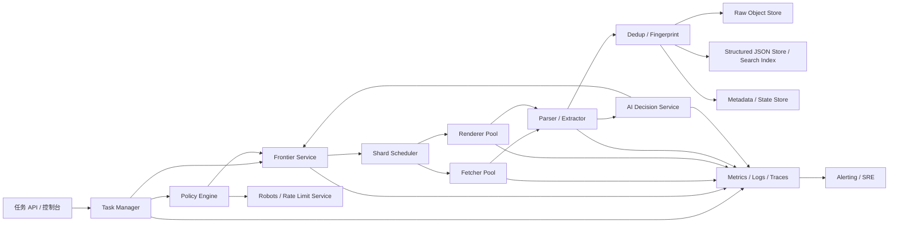
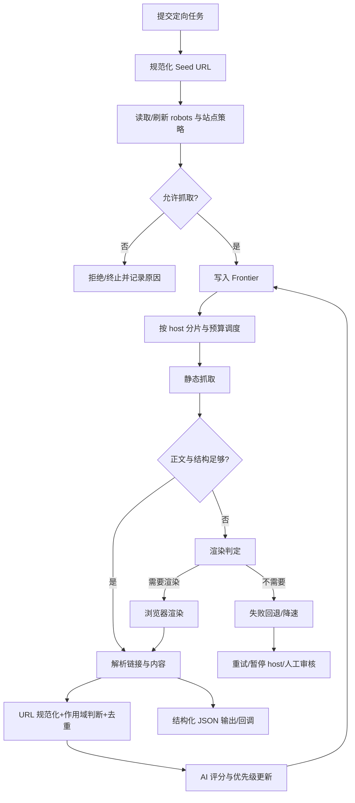
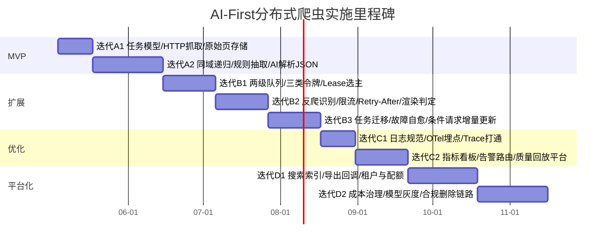

# AI-First通用分布式爬虫系统分阶段实施计划报告

## 执行摘要

本报告建议采用“**规则硬约束 + AI 决策增强**”的路线建设通用分布式爬虫：先把内嵌 Frontier、两级队列与三类令牌调度、静态抓取优先/浏览器回退、URL/内容双重去重、原始页留存做扎实，再把 AI 放到 URL 发现、优先级排序、页面分类、反爬识别、异常检测与自愈等高不确定决策点。面向分阶段交付，最合理路径是：先打通“通用采集 + AI 解析输出 JSON”，随后补齐异常恢复、限流与合规降级，再建设日志与可观测性，最后进入增量更新、多租户、成本治理与平台化。citeturn32view1turn33view1turn21view3turn17view0

## 适用范围与未指定假设

本方案默认目标是：抓取**公开可访问**网页与附件，支持“指定一个 URL 后递归发现并抓取其关联 URL”，并以结构化 JSON 作为主要输出；系统**不依赖第三方业务调度平台**，但允许使用成熟基础中间件承载消息、对象存储和共识能力。法律与合规边界上，默认遵守中国《个人信息保护法》《网络安全法》《数据安全法》《网络数据安全管理条例》；如涉及欧盟/英国自然人数据，还需额外满足目的限制、数据最小化、保留期限与透明告知等要求。公开可见数据并不当然意味着可以无限制复用，尤其是涉及个人信息、敏感字段、跨境流动或站点显式反对抓取时。依据entity["organization","国家互联网信息办公室","china cyberspace regulator"]发布或转发的官方法律文本，中国法要求处理目的明确、范围最小、采取必要安全措施、建立事件应急与日志留存；若跨境提供个人信息，相关条件和阈值还会进一步收紧。若涉及欧盟/英国场景，还需同时考虑法国监管机构和欧盟层面的 web scraping 风险与数据最小化要求。citeturn20search0turn15view2turn1search8turn17view0turn17view1turn13search3turn24view0turn24view1turn24view2turn24view3

下表列出本项目中**必须显式确认**、但当前用户未指定的变量；每个变量都给出小/中/大三套方案，以及切换条件。这里的“切换条件”不是硬性门槛，而是推荐的工程转折点。

| 未指定/假设项 | 小规模方案 | 中规模方案 | 大规模方案 | 何时切换 |
|---|---|---|---|---|
| 目标日抓取规模 | 100 万页/天以内 | 1000 万页/天左右 | 5000 万页/天以上 | 当原始页 90 天留存 >150TB、Frontier 持续积压或单集群无法在批窗内完成时 |
| 并发连接数 | 100–500 | 1000–5000 | 10000+ | 当平均 host 数、活跃 host 数和等待队列增长使单层 worker 明显不足时 |
| JS 渲染比例 | <5% | 5%–20% | >20% | 当静态抓取正文命中率下降、空壳页比例升高、render backlog 长期堆积时 |
| 登录/付费墙处理 | 不处理 | 仅处理客户已授权账号、白名单站点 | 企业合作/受控身份托管 | 当业务明确提供合法授权、审计要求与账号托管方案后 |
| 跨境抓取/GDPR 影响 | 仅境内公开站点 | 含少量境外公开站点 | 面向 EU/UK/多法域 | 当目标域中出现欧盟/英国站点、或数据需要跨境存储/训练时 |
| 预算上限 | <20 万元/月 | 20–80 万元/月 | 80 万元/月以上 | 当渲染、对象存储、推理成本占比任一连续两月超过预算 70% 时 |
| 调度与消息层 | 自研调度 + 轻量队列 | 自研调度 + 高可用队列/日志总线 | 自研调度 + 分层消息与多集群 | 当故障切换、重放、回压或多租户隔离要求明显超过单队列能力时 |

按假设变量，建议形成三种落地模式。**小规模**优先追求尽快交付：同域抓取、静态优先、少量浏览器节点、最小合规闭环。**中规模**开始重点建设韧性：host 级公平调度、租约与迁移、条件请求、近重复检测。**大规模**则进入平台化阶段：多租户、分层存储、跨集群分片、独立渲染农场、模型灰度与严格成本治理。Google 的 crawl budget 指南明确指出：每个 host 都存在独立的抓取能力上限与抓取需求约束，大量重复 URL、无意义 URL 和低质量页面会浪费抓取预算；大站点尤其需要依赖 sitemap、去重和更好的 URL 管理。citeturn23view2turn3search4

## 系统目标与总体架构

从系统目标看，本项目不应被定义为“多进程爬虫程序”，而应被定义为“**可编排、可审计、可恢复、可演进的数据采集平台**”。目标应同时覆盖六类要求：功能性、性能、可扩展性、可靠性、安全性、合规性。功能上，需要支持单 URL 定向递归、批量种子任务、静态抓取与按需渲染、AI 解析输出 JSON、回调与导出。性能上，需要有 host 级礼貌性、任务级 SLA、渲染退避和成本控制。可靠性上，需要以“至少一次执行 + 幂等写入”为基线，而不是追求在复杂网络系统里成本极高的“全链路精确一次”。安全与合规上，则要把 robots、个人信息最小化、日志留存、事件应急、跨境评估与删除链路直接嵌入系统设计。RFC 9309 明确指出 robots 规则只是 crawler 应当遵守的访问约定，**不是**授权机制；中国官方法律文本则要求网络运营者采取监测、日志留存、备份和加密等措施。citeturn33view4turn27search3turn17view0

下面给出建议的需求分解矩阵。此表是工程要求，不是法规原文。

| 维度 | 必选能力 | 推荐量化指标 |
|---|---|---|
| 功能 | 单 URL 定向递归、批量种子、静态抓取、按需渲染、AI 解析 JSON、回调/导出 | 任务创建成功率 >99.5% |
| 性能 | host 礼貌性、并发控制、优先级调度、回压、增量更新 | 单 host 默认 0.2–1 RPS；定义任务级批窗 |
| 可扩展性 | Frontier 分片、worker 横向扩展、渲染节点池化、对象存储扩容 | worker 增长后吞吐近线性提升 |
| 可靠性 | 租约、故障转移、任务迁移、幂等落库、可回放原始页 | leader 切换不丢任务；重复写可抑制 |
| 安全 | 秘钥托管、访问控制、审计日志、镜像扫描、最小权限 | 高危凭证零明文落盘 |
| 合规 | robots、PII 最小化、删除/TTL、跨境评估、不可绕过保护措施 | 高风险任务创建前强制合规检查 |

整体架构建议采用“**控制面 + 数据面**”分层，并坚持“调度逻辑自研、基础能力复用成熟组件”的原则。参考entity["company","Google","search company"] 2026 年公开说明，其现代抓取基础设施本质上更像“中心化 crawling platform + 多 crawler client”的体系；而英文经典论文 UbiCrawler 则证明了基于 consistent hashing 的分布式分片、去中心化任务划分与 graceful degradation 的可行性。因此，本项目最合适的方案不是把爬虫做成一个巨型服务，而是做成：Frontier/Policy/Lease/Task API 组成控制面，Fetcher/Renderer/Parser/AI/Sink 组成数据面。citeturn21view3turn32view0turn32view1



组件职责应当明确而“短链路”。**Task Manager** 负责任务规格、预算、回调、租户与审计。**Policy Engine** 负责 robots、作用域、域策略、限流、渲染策略和 AI 使用阈值。**Frontier Service** 负责 URL 状态和优先级，不负责具体抓取。**Shard Scheduler** 负责把 host/domain 分配给活跃节点。**Fetcher Pool** 只做 HTTP 获取和基础响应处理。**Renderer Pool** 只处理需要浏览器执行的页面。**Parser/Extractor** 进行链接抽取、正文抽取、字段提取。**AI Decision Service** 只做高价值/边界样本判断，不进入所有请求主路径。**Dedup/Sink** 统一做幂等、去重和结果写入。该边界划分有利于把“业务调度平台内嵌”与“基础设施中间件复用”区分开：你不需要第三方业务调度平台，但也没有必要重写消息队列或对象存储。Kubernetes 的 Lease、etcd 的强一致 KV 语义、RabbitMQ quorum queue 的 Raft 复制和 Apache Kafka 的 producer idempotence 都是很好的底座，但“哪个 URL 先抓、哪个 host 冷却、哪个任务迁移”必须由业务系统自己控制。citeturn22view0turn22view3turn22view4turn22view5turn22view6

## AI-First核心能力与定向任务

AI-First 的正确落点，不是“所有环节都上 LLM”，而是“**在最难用规则覆盖、但又会显著影响抓取收益的环节使用 AI**”。英文经典论文《Efficient Crawling Through URL Ordering》证明 URL 访问顺序决定了有限预算下能否更快拿到“重要页面”；《Breadth-First Search Crawling Yields High-Quality Pages》又表明 BFS 本身是很强的基线；Focused Crawling Using Context Graphs、基于 anchor text 的 focused crawling、以及近年的 RL focused crawling 都说明：链接上下文、锚文本与长期收益建模能提高相关页面命中率。与此同时，LLM 零样本文本分类研究证明，在合适任务上，LLM 可以作为低样本或零样本的有效分类器。因此，系统最应纳入 AI 的位置，是 URL 发现增强、优先级排序、页面类型识别、反爬页面识别、渲染判定、异常归因与自愈建议。citeturn10search0turn25view0turn10search1turn11search4turn32view2turn32view3

建议采用“四级决策栈”。第一层是**规则硬约束**：robots、白黑名单、URL 规范化、作用域规则、MIME 和状态码策略。第二层是**廉价特征和轻模型**：URL 模式、锚文本、DOM 位置、模板相似度、体量估计、正文密度。第三层是**任务模型**：页面类型、相关性、渲染必要性、反爬页识别。第四层才是**LLM/多模态模型**：只处理高价值样本、低置信度样本和新站点的冷启动规则生成。这个分层能把 AI 成本和时延稳定在可控区间，同时保留 AI-First 的收益。citeturn10search0turn32view3turn31view0

下面的能力映射建议作为 AI-First 的首版蓝图。

| AI 能力点 | 输入 | 建议输出 | 首版实现建议 |
|---|---|---|---|
| URL 发现增强 | DOM 链接、导航、JSON-LD、sitemap、渲染网络日志 | 候选 URL + 来源 + 置信度 | 规则优先；AI 只识别“相关文章/系列页/下一页”等弱结构链接 |
| URL 优先级排序 | anchor text、上下文、深度、历史命中、模板 | `priority_score` | 先规则加权，再迭代到树模型/RL |
| 页面类型分类 | 标题、DOM 结构、正文密度、schema.org、样本文本 | article/list/profile/login/challenge 等 | 小模型常驻，LLM 处理低置信样本 |
| 反爬识别与合规降级 | 状态码、标题、DOM 特征、脚本、cookie、重定向 | normal/rate_limited/challenge/captcha/auth_required | **只允许降速、延迟、切策略、暂停，不允许绕过** |
| 动态渲染判定 | 首次抓取 DOM、脚本占比、文本缺失、网络错误 | 是否进入 Render Queue | 规则 + 分类器 |
| 异常检测与自愈 | 指标、日志、trace、任务状态 | 异常聚类、原因建议、自愈动作 | 规则自愈先行，AI 做归因排序 |

在“URL 发现”这一点上，规则与 AI 应并行。规则侧至少要覆盖 `<a>`、canonical、pagination、导航条、面包屑、站点地图、robots 中声明的 sitemap、JSON-LD URL 字段，以及浏览器渲染阶段观察到的可公开链接。Google 中文官方文档明确把 sitemap 定义为“提供网站内网页、视频或其他文件信息并说明关系的文件”，并建议维护最新 sitemap；其 crawl budget 文档则强调，大站点应持续维护 URL 清单、减少重复 URL、阻断无价值 URL。citeturn3search4turn23view2

在“优先级排序”上，建议用一个**可解释的统一公式**作为首版，而不是一开始就上端到端 RL。示例评分可以是：

`priority = 0.30*relevance + 0.20*anchor_quality + 0.15*content_likelihood + 0.10*freshness + 0.10*host_budget_bonus + 0.10*parent_quality - 0.05*trap_risk`

其中 `relevance` 可由 AI 相关性打分给出，`trap_risk` 可由参数膨胀、日历翻页、 faceted navigation 模式等规则生成。这样做的好处是，策略可解释、可 A/B、可人工纠偏；等到有足够任务反馈后，再把一部分权重替换成 bandit 或 RL，收益与风险都更可控。Cho 等人的论文、Context Graph focused crawling 以及 TRES RL focused crawling 都支持“排序优于盲抓、长期收益优于只看当前层”的结论。citeturn10search0turn10search1turn32view2

在“内容分类与 JSON 输出”上，Stage 1 不应追求全能抽取，而要优先做“页面类型 + 高价值字段”的稳定输出。LLM 零样本分类可作为冷启动工具，但在线主路径更建议使用小模型或蒸馏分类器；LLM 可在低置信度样本上做裁决，并反向生成规则或标注样本，供后续轻模型训练。这样既能保持 AI-First，又不会把每个页面都变成高费用推理任务。citeturn32view3turn31view0

从entity["company","Cloudflare","web security company"]和entity["company","Amazon Web Services","cloud provider"]公开文档看，现代 Bot/WAF 检测普遍会综合 bot score、JavaScript detections、browser interrogation、fingerprinting 与 behavior heuristics。对本系统而言，这意味着**“反爬识别”是允许且必要的，“反爬绕过”不应进入设计目标”**。系统可以识别：rate limit、challenge page、capTCHA、auth required、WAF block、临时故障；系统允许执行的动作只有：降速、等待 Retry-After、切静态/渲染策略、请求白名单合作、暂停 host、升级人工审核。系统**不得**尝试绕过验证码、登录认证、技术挑战、受访问控制的数据边界。citeturn22view16turn22view17turn22view18turn17view0turn24view0

在动态渲染方面，建议明确实行“**静态优先，按需渲染**”。Google 2026 年公开说明显示，其抓取后由 Web Rendering Service 执行 JavaScript，并以现代浏览器近似方式处理脚本、CSS 和 XHR；Chrome 官方文档说明自 Chrome 112 起 headless 模式已经更新为与普通浏览器更一致的实现；Playwright 文档强调 auto-wait，Puppeteer 则提供基于 DevTools Protocol/WebDriver BiDi 的高层控制 API。对工程实现而言，这些资料共同指向一个结论：浏览器渲染应是独立资源池，而不是所有页面默认路径。只有命中“正文显著缺失、关键选择器为空、脚本壳页、需要等待事件、初抓文本密度异常低”等信号时，才把页面送去 Render Queue。citeturn21view4turn22view13turn22view14turn22view15

定向任务的默认定义应当是：**以 seed URL 为根，在给定作用域、预算和规则内，递归发现并抓取可接受节点**。这里的“可接受”至少满足五项：规范化后未访问；通过 robots 与作用域校验；不超深度/广度/时间预算；不命中 trap 规则；未被预算或 host 冷却抑制。考虑到 BFS 是强基线，但单纯 BFS 容易淹没在导航和列表页中，推荐采用“**层内近似 BFS + 全局优先级堆 + 老化补偿**”的混合策略。也就是说，深度传播仍按层展开，但每次从 frontier 中取出的具体 URL 由优先级分决定，从而兼顾覆盖面与质量。citeturn25view0turn10search0turn23view2

作用域策略推荐分三档。默认是 **same origin**；增强模式是 **same eTLD+1**；跨域只在 `allowlist` 或高置信业务规则下开放。开放跨域的证据，应该来自 canonical、组织内多子站导航、sitemap、显式站群关系或高置信 AI 相关性，而不是普通正文外链。否则“从一篇文章跳到评论系统、社交分享页、CDN、广告点击链”的噪声会迅速吞噬抓取预算。Google 的 crawl budget 文档强调 hostname 级预算，RFC 9309 也要求 robots 在根路径获取并按 authority 处理，因此工程上应以 host 为最小礼貌性控制单元。citeturn23view2turn33view4

关于 robots 和限速，建议把 **RFC 9309 作为实现基线**。它规定 robots 文件位于顶层 `/robots.txt`；成功获取后 crawler 必须遵守可解析规则；4xx 通常意味着 robots 文件不可用，crawler **可以**访问资源；5xx 或网络错误则属于 unreachable，crawler **必须假定 complete disallow**；缓存不宜超过 24 小时。与此同时，Google 自身文档提供了 vendor-specific 行为细节：robots 内容通常缓存 24 小时；Google 不支持 `crawl-delay`；Google 在 robots 5xx场景下存在自身的回退策略。Bing 官方帮助文档则保留了 crawl control 与 crawl-delay 的兼容语义。因此，推荐把 robots 实现拆成两层：**标准层按 RFC 9309 执行，兼容层以 vendor profile 的方式可选模拟 Google/Bing 等差异**。citeturn33view1turn21view0turn21view1turn30search1turn3search3turn3search7

对 429/503 之类状态，不能按普通失败处理。RFC 6585 明确将 429 定义为“在给定时间内请求过多”，并允许 `Retry-After`；Google crawl budget 文档也明确指出 server errors 和 crawl health 会降低抓取能力上限。因此，host 级调度必须实现“`Retry-After` 优先 + 指数退避 + 抖动 + cooldown 窗口”，而不是让 worker 对单 URL 盲重试。citeturn26view0turn26view1turn23view2

关键流程建议如下。



## 内嵌采集调度、存储与合规

调度部分建议使用“**两级队列 + 三类令牌**”模型。两级队列是：全局 Frontier 优先级堆 + per-host ready queue。三类令牌是：**host 礼貌性令牌**、**domain 配额令牌**、**任务预算令牌**。调度循环不是“从所有 URL 里挑一个”，而是“先挑当前可服务的 host，再从该 host 队列中取最佳 URL”。这个设计能把礼貌性、公平性、热点站点控制和任务预算统一起来。它与 UbiCrawler 的 consistent hashing 分片思想兼容，也与 Google crawl budget 文档中“crawl capacity limit + crawl demand”的主机级逻辑一致。citeturn32view0turn23view2

一个实用的轮询顺序可以写成：

`host_score = task_priority + aging_bonus + fairness_debt + host_health - cooldown_penalty`

先选 host，再在 host 内部选择 URL；URL 选择则由前述 `priority_score` 决定。这样既能防止单个高价值任务把所有 worker 吃满，也能避免低优先级 host 永久饥饿。注意，“host_health”必须吸收 429、5xx、network error 和 anti-bot 信号，不然调度器会把失败站点不断重压到更差。citeturn26view1turn22view16turn22view18

为了做到**业务调度内嵌**，推荐把选主和分片元数据建立在强一致状态层之上。Kubernetes 的 Lease 能保证 HA 场景下同一组件同时只有一个激活实例；etcd 官方文档则强调它提供强一致与持久化保证。因此，推荐使用 etcd 维护 Frontier shard 所有权、worker lease、host 冷却表和迁移标记；当 leader 或 shard owner 故障时，等待租约过期后由新 owner 接管即可。这里不需要自己重写共识协议。citeturn22view0turn22view3

消息与执行层的建议是：**小规模用轻量而稳的队列，中大规模进入日志型总线，但业务优先级仍留在 Frontier**。RabbitMQ quorum queue 官方文档说明其基于 Raft 的持久复制与快速 leader election，适合作为高可用工作队列；Apache Kafka 官方文档说明 `acks=all` 提供最强可用保证，启用 idempotence 还可减少重复与乱序；NATS JetStream 提供持久化与回放，适合轻量 streaming/edge；Redis Streams 提供 consumer group，但更适合中小规模与简单场景。综合来看，本项目不应把“调度算法”外包给任何 MQ 的天然出队顺序。citeturn22view4turn22view5turn22view6turn28view1turn5search3

下面的技术比较表，基于上述官方文档整理。

| 能力层 | 首选 | 备选 | 取舍建议 |
|---|---|---|---|
| 选主/租约/分片元数据 | etcd | 数据库悲观锁 | 除非单实例 MVP，否则优先 etcd |
| 工作队列 | RabbitMQ quorum queue | Redis Streams | 小规模任务驱动场景，RabbitMQ 更稳妥 |
| 事件流/重放 | Kafka | NATS JetStream | 进入中大规模、多消费者和审计重放时优先 Kafka |
| 浏览器渲染 | Playwright | Puppeteer | Playwright 在动作等待与多浏览器支持上更完整；Puppeteer 更轻 |
| 结构化检索 | Elasticsearch | OpenSearch 类兼容方案 | 面向全文检索与字段过滤，优先成熟搜索索引 |
| 分析明细 | ClickHouse | HBase 类大表 + 离线计算 | 运营分析与报表优先 ClickHouse；超大 URL 状态表再考虑 HBase |
| 原始页存储 | MinIO/S3 兼容对象存储 | 公有云对象存储 | 自建优先 MinIO；托管优先对象存储服务 |

存储层建议显式拆成四类：**原始页面对象存储、元数据/状态存储、结构化 JSON 检索存储、分析型明细存储**。原始响应体进入对象存储，保证可回放、可审计、可重解析；元数据表保存 URL 状态、租约、指纹和抓取时间；结构化 JSON 进入检索系统，便于字段过滤和全文检索；运营与模型训练则走分析型明细。Elastic 官方文档表明 ingest pipeline 很适合在入索引前做字段清洗、抽取和 enrich；ClickHouse 官方文档则明确指出 `ReplacingMergeTree` 的 deduplication 发生在后台 merge 中，**不能保证实时无重复**；MinIO 文档说明其 erasure coding 采用读写仲裁与恢复机制，适合大规模原始页对象。citeturn22view8turn22view7turn22view9

增量抓取建议采用**条件请求 + 内容指纹**的组合。RFC 7232 规定 `If-None-Match` 与 `If-Modified-Since` 可以让 GET/HEAD 在内容未变化时返回 304，从而避免重复传输；因此每个 URL 记录都应保存 `ETag`、`Last-Modified`、上次内容摘要和模板 cluster。对于首版系统，增量更新不建议过早依赖 DOM diff，而应先用 HTTP validator + 正文摘要比对，后续再增加模板感知。citeturn26view2turn26view3

示例 API 设计如下。

```http
POST /v1/tasks/crawl
Content-Type: application/json

{
  "name": "seed-crawl-demo",
  "seed_url": "https://example.com/start",
  "scope": {
    "mode": "same_origin",
    "allow_etld_plus_one": false,
    "cross_domain_allowlist": []
  },
  "limits": {
    "max_depth": 4,
    "max_urls_total": 20000,
    "max_urls_per_host": 10000,
    "max_branch_per_level": 200,
    "time_budget_sec": 7200,
    "max_render_pages": 800
  },
  "politeness": {
    "default_rps_per_host": 0.5,
    "burst": 2,
    "respect_retry_after": true
  },
  "ai_policy": {
    "url_ranker": "frontier-ranker-v1",
    "page_classifier": "page-type-v1",
    "llm_fallback_ratio": 0.03
  },
  "output": {
    "format": "json",
    "callback_url": "https://client.example/callback"
  }
}
```

```http
GET /v1/tasks/{task_id}

Response:
{
  "task_id": "tsk_01J...",
  "status": "running",
  "progress": {
    "discovered": 8421,
    "fetched": 5910,
    "rendered": 322,
    "deduped": 1401,
    "blocked_by_robots": 118,
    "rate_limited_hosts": 7
  },
  "frontier": {
    "pending": 2330,
    "active_hosts": 54,
    "cooldown_hosts": 9
  }
}
```

```http
POST /v1/callbacks/result
Content-Type: application/json

{
  "task_id": "tsk_01J...",
  "url": "https://example.com/article/123",
  "canonical_url": "https://example.com/article/123",
  "page_type": "article",
  "fetch": {
    "status_code": 200,
    "rendered": false,
    "content_type": "text/html",
    "etag": "\"abc123\"",
    "last_modified": "Wed, 16 Apr 2026 08:22:11 GMT"
  },
  "json_result": {
    "schema_version": "1.0",
    "title": "Example title",
    "language": "zh-CN",
    "summary": "......",
    "fields": {
      "author": "Alice",
      "published_at": "2026-04-16"
    },
    "quality": {
      "extract_confidence": 0.93,
      "content_sha256": "....",
      "simhash64": "...."
    }
  }
}
```

示例数据模型如下。

```json
{
  "task_spec": {
    "task_id": "tsk_01J...",
    "tenant_id": "tenant_a",
    "seed_url": "https://example.com/start",
    "scope_mode": "same_origin",
    "max_depth": 4,
    "max_urls_total": 20000,
    "status": "running",
    "created_at": "2026-04-22T10:00:00Z"
  },
  "url_record": {
    "task_id": "tsk_01J...",
    "url": "https://example.com/article/123?utm=abc",
    "canonical_url": "https://example.com/article/123",
    "url_fp": "blake3-128",
    "host": "example.com",
    "etld_plus_one": "example.com",
    "depth": 2,
    "parent_url_fp": "blake3-128",
    "discovery_source": "anchor",
    "priority_score": 0.873,
    "scope_decision": "accepted",
    "frontier_state": "pending",
    "lease_owner": null,
    "lease_expire_at": null
  },
  "fetch_record": {
    "fetch_id": "fch_01J...",
    "task_id": "tsk_01J...",
    "url_fp": "blake3-128",
    "attempt": 1,
    "status_code": 200,
    "rendered": false,
    "etag": "\"abc123\"",
    "last_modified": "Wed, 16 Apr 2026 08:22:11 GMT",
    "bytes": 182344,
    "latency_ms": 742,
    "fetched_at": "2026-04-22T10:01:12Z"
  },
  "content_record": {
    "content_id": "cnt_01J...",
    "url_fp": "blake3-128",
    "content_sha256": "....",
    "simhash64": "....",
    "template_cluster_id": "tpl_17",
    "page_type": "article",
    "raw_object_uri": "s3://crawler-raw/2026/04/22/....gz",
    "json_doc_id": "doc_01J..."
  }
}
```

反爬与合规策略必须写成“**可以做什么，不可以做什么**”。可以做的包括：真实身份 UA、站点联系信息、基于状态码和页面特征的降速、遵守 `Retry-After`、限流、代理池隔离、白名单合作、浏览器策略切换、PII 脱敏、数据删除和 TTL。不能做的包括：绕过验证码、规避登录认证、突破付费墙、绕开 robots 明示拒绝、使用专门绕过保护的程序/工具。中国《网络数据安全管理条例》明确禁止窃取或以其他非法方式获取网络数据，并禁止提供专门用于此类非法活动的程序、工具；CNIL 的 2026 指引则明确指出，如果网站通过 robots.txt 或 CAPTCHA 明确反对 scraping，控制者不应把这类站点纳入正常收集范围。citeturn17view0turn24view0

因此，IP/代理策略的正确目标不是“伪装成人”，而是**把网络故障隔离、出口信誉管理和地域路由控制做好**。推荐做法是：按任务/租户隔离出口池；对同一 host 绑定稳定出口，减少频繁切换引发的风控；将代理作为“网络路由与稳定性组件”而非“保护绕过组件”；遇到 challenge/captcha/auth-required 时立即转入合规降级流程，而不是继续自动试错。citeturn22view16turn22view17turn22view18

建议的安全与合规检查清单如下。

| 检查项 | 最低要求 | 责任角色 |
|---|---|---|
| 任务合法性 | 业务目标、站点范围、责任人、用途标签完整 | 产品/后端/法务 |
| robots 执行 | 预取 robots；5xx 视为 complete disallow；24h 内刷新 | 后端 |
| 保护措施 | 不绕过登录、验证码、challenge、付费墙 | 后端/AI/法务 |
| PII 最小化 | 默认不抽身份证号、手机号、邮箱等敏感字段；必要时脱敏 | AI/后端/法务 |
| 数据保留 | TTL、按任务/租户删除、审计留痕 | 后端/SRE |
| 日志留存 | 关键安全日志留存不少于 6 个月 | SRE/安全 |
| 跨境检查 | 标记是否 EU/UK、是否出境、是否需安全评估或合同机制 | 法务/安全 |
| 事件应急 | 数据泄露、误抓、误发回调、凭证泄露有预案 | SRE/安全/法务 |

## 可观测性、测试与运维

可观测性部分，建议一开始就基于 Prometheus + Alertmanager + OpenTelemetry + Grafana 建立统一信号体系。Prometheus 官方文档把它定义为开源监控与告警工具包；Alertmanager 负责 dedup、grouping 和 routing；OpenTelemetry 的目标是收集、处理和导出 signals，并通过 TraceId/SpanId/Resource 把日志、指标和链路关联起来；Grafana 则负责把这些数据可视化为面板。换句话说，爬虫平台的可观测性不是“收日志”这么简单，而是要能从任务、host、URL、worker、renderer、模型和对象存储之间做统一关联。citeturn22view10turn22view11turn22view12turn29view1turn7search3

建议把关键指标分为六组。第一组是**任务指标**：任务成功率、完成时间、pending URL 数、发现/抓取/去重比例。第二组是**host 指标**：活跃 host 数、cooldown host 数、429/503 比例、平均抓取间隔。第三组是**渲染指标**：render backlog、render success rate、DOM 就绪耗时。第四组是**AI 指标**：分类置信度分布、LLM fallback ratio、单页 token 成本。第五组是**存储指标**：对象存储写入成功率、索引延迟、重复内容命中率。第六组是**安全与合规指标**：被 robots 拒绝数、疑似 challenge 页比例、含 PII 输出数、删除工单时延。Prometheus 的时间序列模型和标签机制，非常适合把 `tenant/task_id/host/shard/model_version` 做成多维标签。citeturn7search8turn22view10

建议的可视化面板与告警如下。

| 面板 | 关键问题 | 核心图表 |
|---|---|---|
| 任务总览 | 任务是否按期推进 | discovered/fetched/rendered/deduped 趋势、ETA |
| 调度健康 | Frontier 是否积压、host 是否失衡 | pending by shard、active hosts、cooldown hosts |
| 网络与站点健康 | 是否被限流/封禁/网络异常 | 2xx/3xx/4xx/429/5xx 占比、Retry-After 分布 |
| 渲染池 | 浏览器资源是否不足 | render queue depth、browser crash rate、avg render latency |
| AI 质量与成本 | AI 是否有效、是否过贵 | llm fallback ratio、分类误差、token/day |
| 存储与索引 | 是否产生落库瓶颈 | object write latency、index lag、dedup hit ratio |
| 安全与合规 | 是否出现高风险任务或误抓 | robots blocked、PII detections、delete SLA |

测试与验证必须覆盖**性能、准确性、鲁棒性、合规性**四类，而不是只做爬取成功率。性能测试包括：不同活跃 host 数、不同渲染比例、不同 URL 分支因子下的吞吐与延迟。准确性测试包括：页面类型分类准确率、正文抽取字段覆盖率、JSON schema 合格率。鲁棒性测试包括：leader 故障、对象存储写失败、队列重平衡、浏览器崩溃、robots 503、429 暴增。合规性测试则包括：robots 阻断执行、PII 最小化、challenge 页正确停机、删除链路闭环。LogBERT 一类方法说明日志异常检测对系统异常识别是有效方向，但对首版系统而言，先把日志和 trace 打通比直接上复杂 AIOps 更重要。citeturn32view4turn29view1

建议的示例测试用例如下。

| 测试场景 | 输入/故障 | 预期结果 |
|---|---|---|
| robots 404 | 站点无 robots | 允许继续抓取，但记录 `robots_missing=true` |
| robots 503 | robots 连续 5xx | host 进入 complete disallow 冷却，停止下发新 URL |
| `Retry-After` | 返回 429 + `Retry-After: 120` | host 至少 120 秒不再调度 |
| 跨域跳转 | 正文出现第三方外链 | 默认拒绝，除非 allowlist 或规则放行 |
| 空壳页 | 静态抓取得到极少文本 | 进入 Render Queue |
| Challenge Page | 命中标准 challenge 特征 | 识别为 anti-bot，暂停 host，不尝试绕过 |
| 浏览器崩溃 | renderer Pod 退出 | 任务重入队，租约超时后迁移 |
| 对象存储短时故障 | PUT 失败 | 结果进入重试/补偿队列，最终一致落库 |
| 删除请求 | 用户/法务发起按任务删除 | 原始页、索引、明细、缓存均可追踪删除 |

部署与运维方面，推荐容器化并运行在 Kubernetes 集群中，但要强调：Kubernetes 只负责**基础设施编排**，不负责业务抓取优先级。Kubernetes 官方文档指出，Lease 可用于 leader election；Rolling Update 支持零停机增量替换 Pod；HPA 可以自动扩缩 Deployment 或 StatefulSet。对爬虫平台而言，普通 Fetcher/Parser/AI Service 用 Deployment；State/Queue/ObjectStore 用 StatefulSet 或托管服务；Renderer 建议独立节点池，避免浏览器进程抢占普通抓取节点。HPA 则应绑定 `queue_depth`、`render_backlog`、`host_active_count` 这类业务指标，而不是只看 CPU。citeturn22view0turn22view1turn22view2

模型上线建议采用“**影子评估 → 小流量灰度 → host 白名单扩容**”三步。也就是说，新模型先只读不决策；再在少量任务或少量 host 上替代老模型；确认 `extract_confidence`、`render_fallback_ratio`、`anti_bot_false_positive` 和 token 成本不劣化后，再逐步扩大。这样能避免 AI 模型更新直接冲击抓取主路径。citeturn31view0

## 技术选型与开源自研权衡

本项目最需要避免的误区，是“既然不使用第三方调度平台，就全部自研”。真正合理的边界是：**业务调度、作用域规则、优先级函数、迁移和合规执行自研；消息、对象存储、索引、共识复用成熟组件。** 这样才能把研发资源投到真正有区分度的部分。下面的权衡表基于官方文档与公开资料整理。citeturn22view3turn22view4turn22view5turn28view1turn22view8turn22view7turn22view9turn28view0

| 类别 | 方案 | 优势 | 风险/代价 | 建议 |
|---|---|---|---|---|
| 协调层 | etcd | 强一致、Watch、Lease 成熟 | 需要控制写热点 | 推荐默认 |
| 队列层 | RabbitMQ quorum queue | 适合高可用工作队列、Raft 复制 | 超大规模事件流不如 Kafka | MVP/扩展期推荐 |
| 事件流 | Kafka | 持久重放、消费者组、幂等 producer | 运维复杂度更高 | 中大规模推荐 |
| 轻量流式 | NATS JetStream | 内建持久化、回放、边缘友好 | 生态与团队熟悉度要求 | 边缘/轻量场景可选 |
| 渲染 | Playwright | auto-wait、多浏览器支持、测试生态好 | 资源开销较高 | 推荐默认 |
| 渲染 | Puppeteer | 简洁、Chrome 控制直接 | 多浏览器与用例覆盖略弱 | 轻量备选 |
| 检索 | Elasticsearch | 全文检索、字段过滤、injest pipeline | 资源成本相对高 | 推荐默认 |
| 分析 | ClickHouse | 高吞吐明细分析、报表快 | 实时 dedup 不能过度依赖 | 推荐默认 |
| URL 大宽表 | HBase | Regions/WAL/Compaction 适合超大表 | 运维门槛高 | 只在超大规模引入 |
| 原始页存储 | MinIO/S3 兼容 | 对象存储天然适合原始页 | 需关注生命周期与小文件聚合 | 推荐默认 |

对“开源/自研”的更细建议如下。**自研部分**：Frontier、host 调度器、URL 规范化、作用域引擎、租约迁移、JSON schema、合规检查器、成本治理。**优先复用开源部分**：HTTP 客户端、浏览器自动化控制、对象存储、搜索索引、日志与监控栈。**谨慎自研部分**：消息 WAL、共识协议、全文检索内核。因为从工程回报看，这些后者很难构成业务壁垒，却会显著拖慢交付。citeturn22view3turn22view8turn22view10

## 实施路线、资源成本与里程碑

按照用户给定的四个阶段，推荐映射为：**MVP = 通用采集与 AI JSON 输出**，**扩展 = infra 异常恢复/反爬/限流/试错**，**优化 = 日志收录与可观测性**，**平台化 = 其他扩展**。每个迭代建议控制在 2–6 周，保证“可上线、可验收、可回滚”。下面的甘特图给出一条约 28 周的可执行基线；实际可按团队人数与站点复杂度压缩或拉长。



下面给出更细的迭代计划表。时间是建议值，假定团队核心配置约为：后端 2–3 人、AI 工程师 1–2 人、SRE 1 人、测试 1 人、产品 0.5–1 人、法务/合规按阶段参与。

| 阶段 | 迭代 | 时间 | 交付物 | 验收标准 | 负责人角色建议 |
|---|---|---:|---|---|---|
| MVP | A1 | 2 周 | 任务 API、URL 规范化、基础 Fetcher、对象存储落盘、最小 robots 支持 | 可提交任务；原始页可回放；同域静态抓取通路打通 | 后端、测试 |
| MVP | A2 | 4 周 | BFS/DFS 混合递归、规则抽取、页面类型分类、AI 解析 JSON、回调接口 | 同域任务成功率 >95%；JSON schema 合格率 >90%；字段抽取可解释 | 后端、AI、测试、产品 |
| 扩展 | B1 | 3 周 | Frontier 分片、两级队列、三类令牌调度、Lease 选主、worker 重平衡 | leader 切换不丢任务；host 公平调度生效；重复执行可幂等吸收 | 后端、SRE |
| 扩展 | B2 | 3 周 | 429/503 处理、Retry-After、反爬识别、动态渲染判定、Render Queue | 429 主动退避有效；challenge 页停机正确；渲染只命中必要页 | 后端、AI、测试 |
| 扩展 | B3 | 3 周 | 任务迁移、故障转移、自愈动作、条件请求、近重复检测 | 节点故障后自动恢复；304 命中后带宽下降；近重复归并正确 | 后端、SRE、测试 |
| 优化 | C1 | 2 周 | 结构化日志规范、OTel 埋点、trace id 打通、日志采集链路 | 从任务到 URL 到 worker 可 trace 关联；关键异常可回溯 | 后端、SRE |
| 优化 | C2 | 3 周 | Prometheus 指标、Grafana 面板、Alertmanager 路由、回放工具 | 有任务/调度/渲染/合规核心看板；告警噪音可控 | SRE、后端、测试 |
| 平台化 | D1 | 4 周 | Elasticsearch 检索、结果导出、多租户、配额与审计 | 多租户隔离有效；导出与回调稳定；审计日志完整 | 后端、SRE、产品 |
| 平台化 | D2 | 4 周 | 模型灰度、成本报表、删除链路、跨境/合规工作流 | 模型可灰度回滚；删除请求闭环；成本按任务/租户可归因 | AI、后端、SRE、法务/合规 |

分阶段验收建议再汇总如下。**MVP 阶段**追求“能跑、可回放、能输出 JSON”；**扩展阶段**追求“遇到故障和反爬也不失控”；**优化阶段**追求“能看见、能解释、能报警”；**平台化阶段**追求“多租户、可治理、可审计、可持续降本”。

资源与成本估算方面，建议使用**公式 + 场景表**两层表达。先给公式，再给小/中/大三种假设示例。公式如下：

- **带宽日均量**  
  `BW_day ≈ N_pages × (B_static + R_js × B_render_extra)`  
- **90 天原始页存储**  
  `Storage_90d ≈ N_pages/day × B_stored × 90 × ReplicationFactor`
- **AI 日推理成本**  
  `AI_cost/day ≈ N_ai × (T_in/1,000,000 × P_in + T_out/1,000,000 × P_out)`

其中 `N_ai = N_pages × fallback_ratio`。以entity["company","OpenAI","ai company"]官方价格页为例，`gpt-5.4 nano` 当前标准价是输入 `$0.20/1M tokens`、输出 `$1.25/1M tokens`；对象存储若按 Amazon S3 Standard 的公开价格估算，前 50TB/月约为 `$0.023/GB`。这些价格会随区域、模式和供应商有所差异，因此下表只用于容量规划，不用于财务报销。citeturn31view0turn14search0

| 场景 | 假设 | 建议节点数 | 90 天原始页存储 | 平均入站带宽 | AI 费用示例 |
|---|---|---|---|---|---|
| 小规模 | 100 万页/天；静态 300KB；JS 5%；浏览器额外 800KB；LLM fallback 3% | 协调 3；Fetcher 4–6；Renderer 2；Parser/AI 2 | 约 15TB（按 180KB/页存储估算） | 约 30–40 Mbps | 若单页 800 入/120 出 token，约 `$9.3/天` |
| 中规模 | 1000 万页/天；静态 350KB；JS 10%；浏览器额外 900KB；fallback 3% | 协调 3；Fetcher 20–30；Renderer 8–12；Parser/AI 6–8 | 约 180TB（按 220KB/页） | 约 350–450 Mbps | 约 `$93/天` |
| 大规模 | 5000 万页/天；静态 400KB；JS 20%；浏览器额外 1000KB；fallback 3% | 协调 5；Fetcher 80+；Renderer 20–40；Parser/AI 12+ | 约 1PB（按 260KB/页） | 约 3–4 Gbps | 约 `$465/天` |

如果把小规模场景的 15TB 原始页放入 S3 Standard 类价格区间，月成本大约在 `15 × 1024 × 0.023 ≈ 353 美元` 量级；如果 3% 样本走 `gpt-5.4 nano`，按上面的 token 假设，月成本约为 `9.3 × 30 ≈ 279 美元`。因此，**对象存储与浏览器渲染成本通常先于 LLM 成本成为第一大头，除非你让 LLM 常驻主路径。**citeturn31view0turn14search0

最后，建议把项目成败标准聚焦在四个可验证结果上。第一，**抓得到**：任务能稳定跑完，且对站点和网络冲击可控。第二，**抽得准**：JSON 输出稳定、可解释、可回放。第三，**撑得住**：限流、故障、反爬和节点波动不会让系统失控。第四，**守得住**：有合规边界、删除能力、审计留痕和成本视图。只要这四个结果按阶段落地，系统就具备从“采集工具”长成“数据采集平台”的基础。citeturn17view0turn22view11turn22view12

## 优先参考资料

以下资料按“**中文官方优先，英文官方与权威论文补充**”排序；为避免重复罗列原始 URL，以下均以可点击来源形式给出。

### 中文官方资料

- 《网络数据安全管理条例》（中文官方） citeturn17view0
- 《中华人民共和国个人信息保护法》（中文官方） citeturn15view0turn20search0
- 《中华人民共和国网络安全法》（中文官方） citeturn15view2turn27search3
- 《中华人民共和国数据安全法》（中文官方） citeturn1search8
- 《数据出境安全评估办法》（中文官方） citeturn0search7
- 《数据出境安全管理政策法规问答（2026年1月）》（中文官方） citeturn13search3
- 《司法部、国家网信办负责人就〈网络数据安全管理条例〉答记者问》（中文官方） citeturn17view1
- Google 搜索中心中文文档：站点地图（中文官方） citeturn3search0turn3search4

### 英文官方资料

- RFC 9309: Robots Exclusion Protocol（英文官方） citeturn33view1turn33view4
- RFC 6585: 429 Too Many Requests（英文官方） citeturn26view0turn26view1
- RFC 7232: Conditional Requests（英文官方） citeturn26view2turn26view3
- Google: Inside Googlebot 2026（英文官方） citeturn21view3turn21view4turn21view5
- Google: Crawl Budget Management（英文官方） citeturn23view2
- Google: robots.txt interpretation（英文官方） citeturn21view0turn21view1turn30search1
- Kubernetes：Leases / Rolling Update / HPA（英文官方） citeturn22view0turn22view1turn22view2
- etcd API guarantees（英文官方） citeturn22view3
- RabbitMQ quorum queues（英文官方） citeturn22view4
- Apache Kafka producer configs（英文官方） citeturn22view5turn22view6
- Elastic ingest pipelines（英文官方） citeturn22view8
- ClickHouse ReplacingMergeTree（英文官方） citeturn22view7
- MinIO erasure coding（英文官方） citeturn22view9
- Prometheus / Alertmanager / OpenTelemetry（英文官方） citeturn22view10turn22view11turn22view12turn29view1
- Playwright / Chrome Headless / Puppeteer（英文官方） citeturn22view13turn22view14turn22view15
- Cloudflare Bot Management / AWS WAF Bot Control（英文官方） citeturn22view16turn22view17turn22view18
- OpenAI API Pricing（英文官方） citeturn31view0
- Amazon S3 Pricing（英文官方） citeturn14search0

### 权威论文与研究

- Efficient Crawling Through URL Ordering（英文论文） citeturn10search0
- Breadth-First Search Crawling Yields High-Quality Pages（英文论文） citeturn25view0
- Focused Crawling Using Context Graphs（英文论文） citeturn10search1
- Focused Crawling by Exploiting Anchor Text（英文论文） citeturn11search4
- UbiCrawler: a scalable fully distributed Web crawler（英文论文） citeturn32view0turn32view1
- Tree-based Focused Web Crawling with Reinforcement Learning（英文论文） citeturn32view2
- Large Language Models Are Zero-Shot Text Classifiers（英文论文） citeturn32view3
- LogBERT: Log Anomaly Detection via BERT（英文论文） citeturn32view4